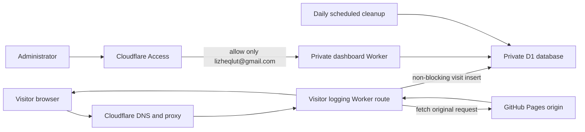

# Cloudflare Visitor Logging Design

Date: 2026-08-06  
Status: Approved

## Context

The site at `https://lizhe.link/` is a Jekyll site hosted by GitHub Pages from `shanmon110/lz`. The existing public visitor badge will be removed. The replacement is a private visitor-log system built on Cloudflare Workers, D1, and Cloudflare Access.

This system is intended for site security and traffic analysis. It records network and request metadata, not a verified human identity. A shared, mobile, institutional, proxy, or VPN address can represent multiple people, so a distinct IP address must never be presented as a distinct person.

## Goals

- Record each HTML page visit with the visitor's raw IP address, precise time, requested page, referrer, user-agent summary, and Cloudflare-provided network/location metadata.
- Keep raw visit records for 90 days and purge older rows automatically every day.
- Provide a private dashboard at `https://logs.lizhe.link/`.
- Allow dashboard access only to `lizheqlut@gmail.com` through Cloudflare Access email authentication.
- Keep the public website available if logging or D1 fails.
- Stay within Cloudflare's free Workers and D1 allowances for normal personal-site traffic.
- Give visitors a concise privacy notice linked from the public footer.

## Non-goals

- Identifying a named person solely from an IP address.
- Fingerprinting visitors or correlating them across unrelated websites.
- Using tracking cookies or local browser storage on the public site.
- Logging images, stylesheets, JavaScript, fonts, PDFs, or other static-asset requests as page visits.
- Publishing visit totals or individual logs publicly.
- Building a general-purpose analytics or account-management platform.

## Architecture

### Public-site request path

`lizhe.link` remains hosted by GitHub Pages. Its DNS zone is moved to Cloudflare and proxied. A Worker Route on `lizhe.link/*` runs in front of the existing GitHub Pages origin. The Worker calls `fetch(request)` to pass the request to the origin defined by the proxied DNS record.

The Worker classifies a page visit only when all of the following are true:

- the request method is `GET`;
- `Sec-Fetch-Dest` is `document`, or, as a compatibility fallback, `Accept` contains `text/html`;
- the path is not the private dashboard, a health check, or a known static-asset extension.

The origin request begins immediately. The D1 insert runs through `ctx.waitUntil()` and is isolated from the origin response. A database error is recorded in Worker operational logs but does not replace, delay intentionally, or fail the GitHub Pages response.

### Private dashboard path

The dashboard is served at `logs.lizhe.link`. Cloudflare Access protects the entire hostname before requests reach the Worker. The Access policy is deny-by-default and contains one Allow rule for the exact email `lizheqlut@gmail.com`. Email authentication uses a one-time code. No dashboard API route is exposed outside the Access-protected hostname.

The dashboard and public proxy may live in one Worker project with hostname-based routing, while keeping public and admin handlers in separate modules. Both use the same D1 binding.

## Data Model

The `visits` table contains:

| Field | Purpose |
|---|---|
| `id` | D1-generated integer primary key |
| `visited_at_utc` | Server-generated UTC timestamp with millisecond precision |
| `ip_address` | Raw client IP from the trusted Cloudflare request header |
| `method` | HTTP method, expected to be `GET` for stored page visits |
| `host` | Requested host |
| `path` | URL path without query parameters |
| `query_string` | Always blank; query parameter names and values are never stored |
| `referrer` | Sanitized referrer scheme, host, optional port, and pathname; userinfo, query, and fragment are removed |
| `user_agent` | Raw user agent, length-limited before storage |
| `browser_summary` | Derived browser/device summary for display |
| `country` | Cloudflare-provided country code |
| `region` | Cloudflare-provided region code/name when available |
| `city` | Cloudflare-provided approximate city when available |
| `asn` | Cloudflare-provided autonomous system number when available |
| `colo` | Cloudflare data-center code |
| `cf_ray` | Cloudflare request identifier when available |
| `is_suspected_bot` | Heuristic flag derived from the user agent |

No request cookies, authorization headers, form bodies, email addresses, or other page content are stored. Query strings are intentionally blank for every visit. Referrers retain only scheme, host, optional port, and pathname; userinfo, query, and fragment are removed, and malformed referrers are stored as empty strings.

Indexes cover `visited_at_utc`, `ip_address`, `country`, `path`, and `is_suspected_bot` to support the approved filters. The schema has a migration history so deployment and rollback do not depend on manual dashboard edits.

## Retention and Cleanup

A Cloudflare scheduled trigger runs once per day and deletes rows where `visited_at_utc` is older than 90 days. The deletion boundary is calculated in UTC. A supporting time index prevents the cleanup from scanning the full table.

The deployment verification creates a controlled row older than 90 days, runs the cleanup handler, and verifies that the old row is removed while a current row remains. Retention failures are visible in Worker operational logs. No archive of deleted raw IP data is created.

## Dashboard

The dashboard defaults to the newest visits and displays Hong Kong time (`Asia/Hong_Kong`) while retaining UTC in the database.

### Summary

- page visits today;
- page visits in the last 7 days;
- page visits in the last 30 days;
- distinct IP counts for the same periods, labeled explicitly as network addresses rather than people.

### Visit table

The table displays Hong Kong time, full IP, country/city, page, referrer, and browser/device summary. It is ordered newest-first, uses server-side pagination, and returns 50 rows per page.

Filters cover date range, exact or partial IP, country, path, and suspected-bot status. Suspected bots are hidden by default but can be included. Bot classification is a best-effort user-agent heuristic on the free plan and is not represented as authoritative.

CSV export uses the active filters and applies a reasonable maximum row count per export. CSV values are escaped against spreadsheet formula injection before download. The initial version has no public sharing, record editing, or manual deletion UI.

## Privacy Notice

The public visitor badge is removed. A `Privacy` link is added to the site footer and opens `/privacy/`. The notice states, in concise language, that the site records IP address, access time, requested page, referrer, browser information, and approximate network/location metadata for security and traffic analysis; records are accessible only to the site administrator, are not sold or shared for advertising, and are automatically deleted after 90 days.

The public logging path uses no cookies or browser storage. Cloudflare Access may use its own authentication cookie only on the private dashboard hostname.

## Security

- Cloudflare Access is applied to the entire `logs.lizhe.link` hostname, with an exact-email allow rule and deny-by-default behavior.
- D1 is never bound to a publicly callable generic SQL endpoint.
- Dashboard queries use bound parameters, fixed sort columns, capped date ranges, and capped pagination/export sizes.
- Dashboard responses set `Cache-Control: no-store` and appropriate anti-framing and content-security headers.
- Raw IP values are not written to application console logs or GitHub Actions logs.
- Secrets, account identifiers, and deployment credentials are stored in Cloudflare secrets or the authorized deployment environment, never committed to GitHub.
- Public request bodies and sensitive headers are never recorded.

## Reliability and Failure Handling

- Origin availability takes priority over analytics. D1 writes are non-blocking and their failures do not alter the origin response.
- If the Worker itself is unhealthy, the rollback is to remove or disable the Worker Route so the proxied DNS hostname goes directly to GitHub Pages.
- The dashboard returns a clear error without exposing internals if D1 is unavailable.
- Cleanup is idempotent and safe to retry.
- DNS records, proxy settings, Worker routes, Access policy identifiers, and D1 migration versions are recorded before and after deployment.

## Deployment Sequence

1. Inventory and export all current DNS records for `lizhe.link`, including record values, proxy state, TTL, mail records, and verification records.
2. Confirm the current GitHub Pages custom-domain and HTTPS state.
3. Create or connect a Cloudflare account and add the `lizhe.link` zone without changing nameservers yet.
4. Reproduce the DNS zone exactly in Cloudflare and validate it before cutover.
5. Create the D1 database, apply migrations, deploy the Worker to a test endpoint, and run automated tests.
6. Create `logs.lizhe.link`, configure Cloudflare Access, enable email authentication, and restrict the policy to `lizheqlut@gmail.com`.
7. Commit the public-site changes that remove the visitor badge and add the privacy page/footer link; verify GitHub Pages deploys them.
8. Change the authoritative nameservers to Cloudflare, enable the proxied site record, and confirm DNS and TLS health.
9. Attach the Worker Route to `lizhe.link/*` and verify the origin response and one-row-per-document logging behavior.
10. Verify the private dashboard, CSV export, 90-day cleanup, and failure fallbacks.
11. Monitor availability, Worker errors, D1 writes, and free-plan usage after cutover.

No destructive DNS, Worker, or D1 action is performed without resolving the exact target and preserving a rollback record.

## Rollback

The first rollback action is to disable the Worker Route while leaving Cloudflare DNS proxying in place. This sends requests directly to the GitHub Pages origin defined by DNS. If the Cloudflare zone itself causes a problem, restore the exported DNS configuration at the previous authoritative provider and revert the nameservers.

The GitHub Pages repository remains the source of truth for site content throughout the migration. D1 data is retained during rollback and deleted only after the site is stable and the owner explicitly authorizes deletion.

## Verification and Acceptance Criteria

The implementation is accepted only when all of the following are demonstrated with fresh evidence:

- the GitHub Pages origin, custom domain, and HTTPS remain healthy;
- HTML pages, images, styles, scripts, PDFs, redirects, and the existing custom domain behave as before;
- one normal browser page load creates exactly one visit row;
- static assets do not create visit rows;
- stored IP, UTC timestamp, Hong Kong display time, path, referrer, country/city, ASN, and browser summary match controlled requests where the data is available;
- a forced D1 insert failure does not prevent the page from loading;
- an unauthenticated request to the dashboard is challenged by Access;
- an email other than `lizheqlut@gmail.com` is denied;
- `lizheqlut@gmail.com` can authenticate and load the dashboard;
- filters, server-side pagination, default bot hiding, and CSV escaping/export behave correctly;
- the 90-day cleanup removes an expired fixture and retains a current fixture;
- the public visitor badge is absent and the Privacy link and notice are present;
- DNS and Worker rollback procedures are exercised or dry-run with exact commands and targets;
- measured usage remains within the expected free-plan allowances for the site's traffic.

## Cost and Operational Boundaries

The design targets the Cloudflare Workers Free plan and D1 free allowances. It does not depend on Enterprise HTTP Logpush, paid Bot Management, or a third-party log-storage service. If usage approaches a free limit, the administrator is alerted before any upgrade; no paid plan is enabled automatically.

## References

- [Cloudflare Worker Routes](https://developers.cloudflare.com/workers/configuration/routing/routes/)
- [Cloudflare Workers pricing](https://developers.cloudflare.com/workers/platform/pricing/)
- [Cloudflare D1](https://developers.cloudflare.com/d1/)
- [Cloudflare Access policies](https://developers.cloudflare.com/cloudflare-one/access-controls/policies/)
- [Cloudflare one-time PIN login](https://developers.cloudflare.com/cloudflare-one/integrations/identity-providers/one-time-pin/)
- [Hong Kong PCPD online behavioural tracking guidance](https://www.pcpd.org.hk/english/resources_centre/publications/files/online_tracking_e.pdf)
